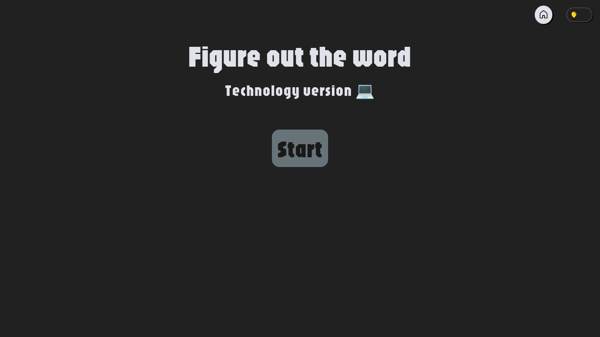
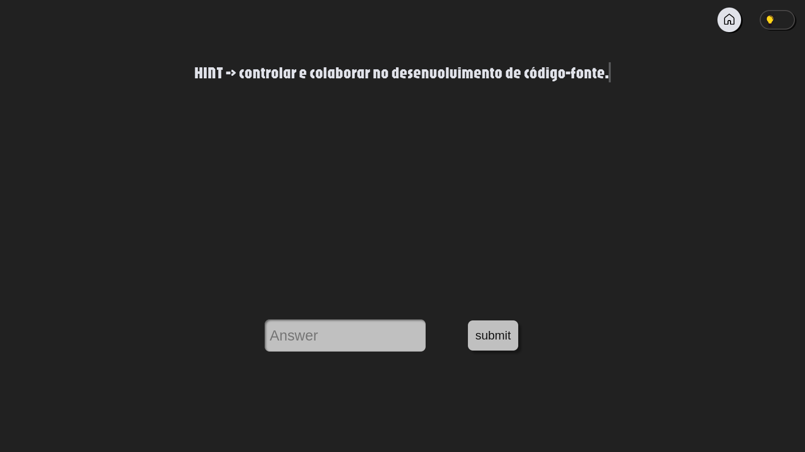

# Discover the word

Discover the word is my personal project of a minigame
made with [Python](https://www.python.org/) and [Django](https://www.djangoproject.com/) framework.

I created this game was to improve my django and python abilities. Is a simple game
but I learned several thinks with this project.

Game repository: [Discover_the_word](https://github.com/4ntho0ny/Discover_the_word)

---

## Stream of game

### Start page

The game start in initial screen:

### Game page

Once game started, the player is redirected to game screen, where needs to discover the word. The game give hint about words.

### Wrong answer message

A warning is show if the player give wrong answer:

![Wrong answer]

### Win page

If the answer is correct. Won the game!

![Winner page]