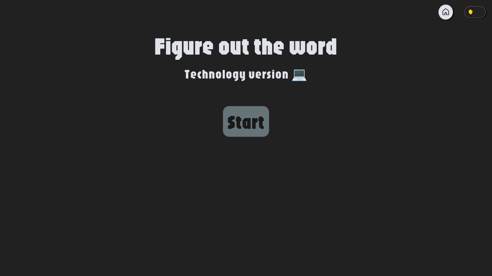
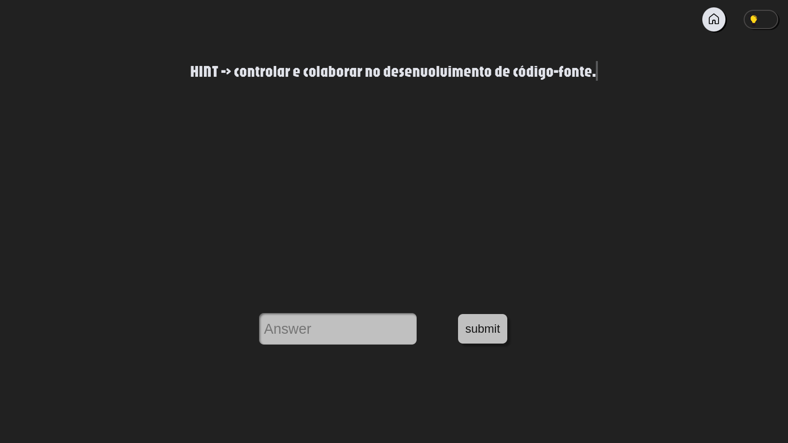

# Discover the word

Discover the word is my personal project of a minigame
made with [Python](https://www.python.org/) and [Django](https://www.djangoproject.com/) framework.

I created this game was to improve my django and python abilities. Is a simple game
but I learned several thinks with this project.

## The game

The game start in initial screen:



---

Once game started, the player is redirected to game screen, where needs to discover the word. The game give hint about words.



---

A warning is show if the player give wrong answer:

![Wrong answer]

```py
def whatever():
    return None
```

## Project layout

    mkdocs.yml    # The configuration file.
    docs/
        index.md  # The documentation homepage.
        ...       # Other markdown pages, images and other files.

## Custom fences
